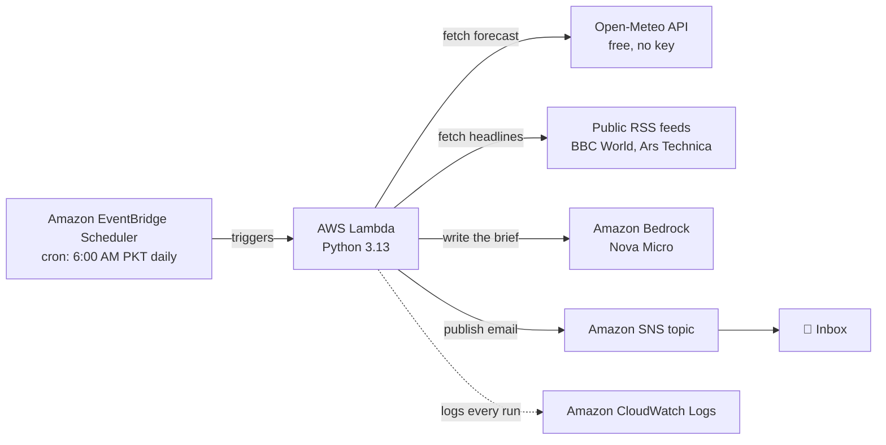

# DayBreak — an always-on morning brief agent ☀️

**Weekend Agent Challenge submission (AWS Builder Center, July 17–20, 2026).**
📖 **Read the story:** [Weekend Agent Challenge: DayBreak — the morning brief that writes itself](https://builder.aws.com/content/3GdZOr6eF0NaewoIWikF0ZpLV6i/weekend-agent-challenge-daybreak-the-morning-brief-that-writes-itself)

DayBreak is a personal AI agent that runs completely unattended. Every morning at
6:00 AM (Pakistan time) it wakes up on a schedule, gathers today's weather for
Islamabad and the latest world + tech headlines, asks **Amazon Bedrock (Nova
Micro)** to write a short, friendly morning brief, and emails it via **Amazon
SNS** — all before its owner is awake. Nobody presses a button.

## Architecture



| AWS service | Role |
|---|---|
| **EventBridge Scheduler** | Timezone-aware cron trigger (`cron(0 6 * * ? *)`, Asia/Karachi) — the "always-on" part |
| **AWS Lambda** | Runs the agent code (Python, standard library + boto3 only, zero external packages) |
| **Amazon Bedrock (Nova Micro)** | Turns raw weather + headlines into a warm, human morning brief |
| **Amazon SNS** | Delivers the brief to email |
| **CloudWatch Logs** | Evidence of every unattended run |
| **IAM** | Least-privilege roles for Lambda and the Scheduler |

## Repository layout

```
src/lambda_function.py        The entire agent (single file, no dependencies)
infra/*.json                  IAM trust + permission policies
scripts/local_test.py         Run the data-gathering logic locally
docs/                         Architecture notes and article material
```

## Resilience

Every data source is wrapped independently: if one RSS feed is down the brief
still ships with the rest; if Bedrock itself fails, a plain-text fallback brief
is assembled from the raw data so the agent **always reports back**.

## Cost

Everything fits in the AWS Free Tier; Nova Micro costs fractions of a cent per
brief. Expected monthly cost: **well under $0.10**.

## Deploy

See [docs/deployment.md](docs/deployment.md) (added during the challenge build).
